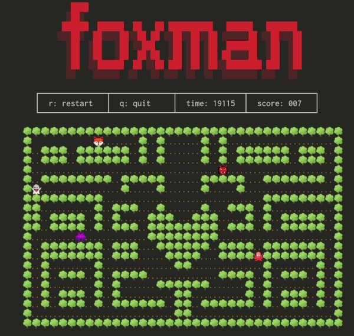

# foxman



This game is made as some kind of proof of concept. I've done a few games, for instance [RETRO TANK](https://github.com/claes-magnus/retro-tank/) and [The Void](https://github.com/claes-magnus/the-void), using 'images' (the normal thing to do) and thought it would be interesting to apply the same game programming techniques using characters only and using node.js. This 'design choice' naturally makes the problems easier. 

I've only tried the game on my machine. I use Pop_OS, a branch of Ubuntu (Linux). 

## Setup
```
npm install

node src/foxman.js
```
